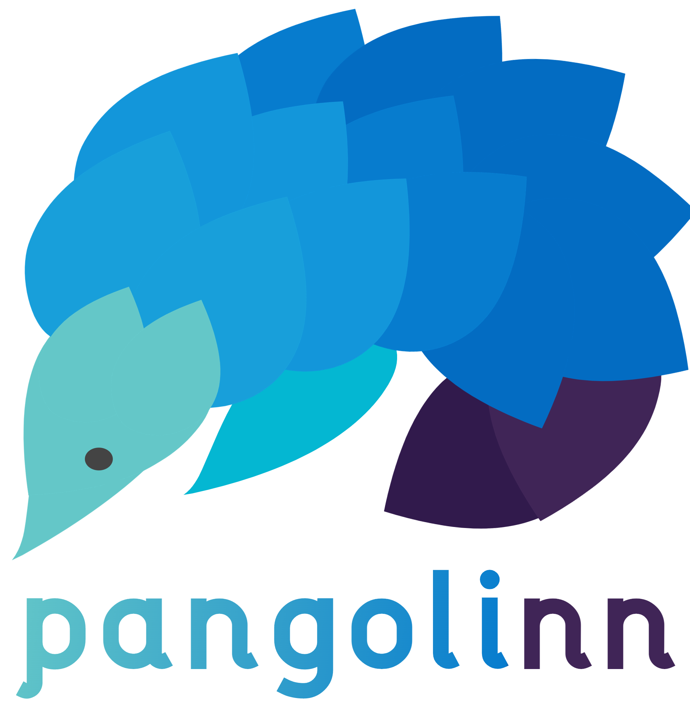

<div align="center">
  
</div>

# pangolinn: Unit Testing for Neural Networks

As a Pangoling looks for bugs and catches them, the goal of this
library is ot help developers finding bugs in their neural networks
and newly-created models.

Currently, the projects includes: TODO

## Installation

TODO

## Usage

TODO

## Support
Tell people where they can go to for help. It can be any combination of an issue tracker, a chat room, an email address, etc.

## Contributing
State if you are open to contributions and what your requirements are for accepting them.

For people who want to make changes to your project, it's helpful to have some documentation on how to get started. Perhaps there is a script that they should run or some environment variables that they need to set. Make these steps explicit. These instructions could also be useful to your future self.

You can also document commands to lint the code or run tests. These steps help to ensure high code quality and reduce the likelihood that the changes inadvertently break something. Having instructions for running tests is especially helpful if it requires external setup, such as starting a Selenium server for testing in a browser.

## Citation

If using this repository, please consider citing:

```
@inproceedings{Papi2023ReproducibilityIN,
  title={{Reproducibility is Nothing without Correctness: The Importance of Testing Code in NLP}},
  author={Sara Papi and Marco Gaido and Andrea Pilzer and Matteo Negri},
  year={2023}
}
```
